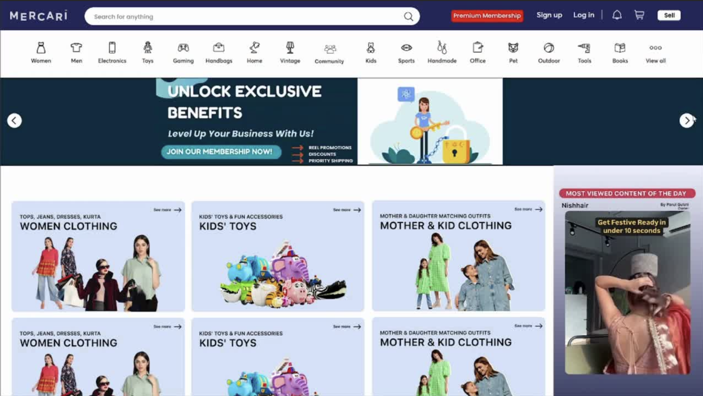
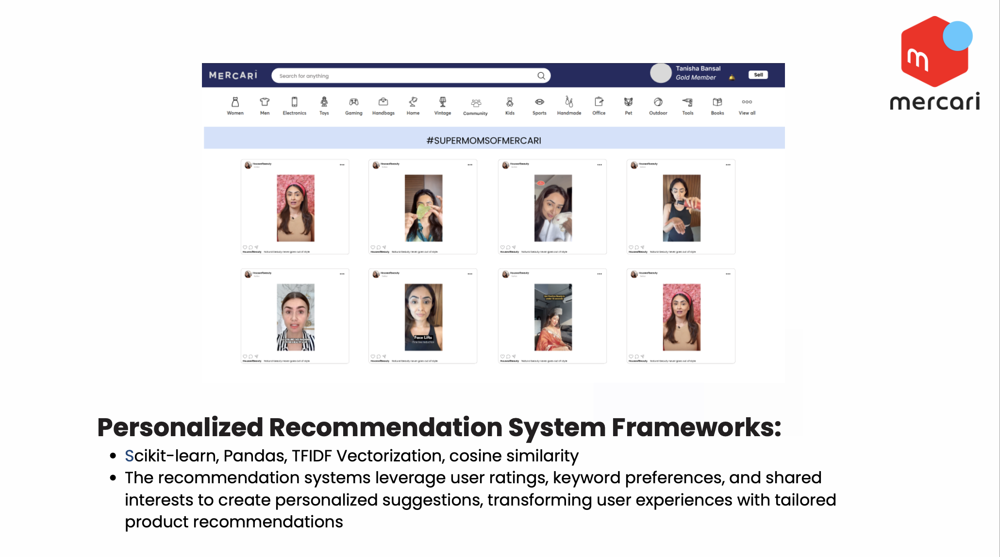
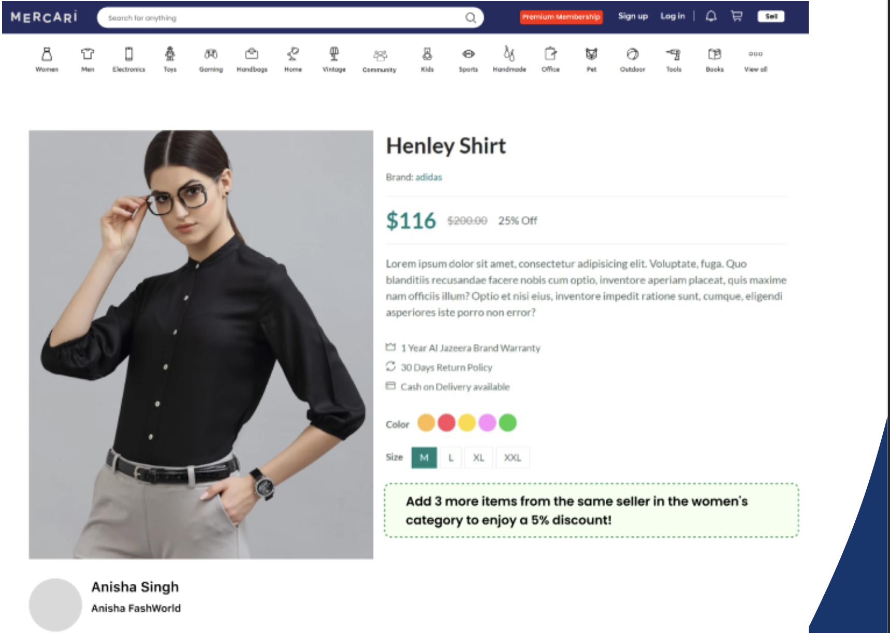

# Mercari-Women-Hackathon

## Project Overview
This project, inspired by the Mercari Women Hackathon, aims to enhance the engagement of women users on the Mercari app. It introduces innovative features like community reels, personalized recommendations, and exclusive discounts tailored to female shoppers.

___

## Problem Statement
Engagement of women users on the Mercari app is a crucial focus. The project proposes solutions to enhance their experience and encourage active participation.

___

## Solutions

### 1. Community Reels Feature
- **Sellers Create Reels**: Engage buyers through short product videos.
- **Membership Programs**:
  - Priority shipping for members.
  - Access to exclusive events and analytics.
- **Featured Reels**: Top-performing reels are highlighted on the homepage for 24 hours.

### 2. Women’s Category Discounts
- **Discount Offer**: Buyers receive discounts on purchases of 3 or more products from the same seller.
- **Encourages Bulk Purchases**: Drives sales and enhances customer satisfaction.
- **Empowering Women**: Focused on women's categories to drive loyalty and engagement.

### 3. Personalized Recommendation System
- **Frameworks Used**: Scikit-learn, Pandas, TF-IDF Vectorization, cosine similarity.
- **How It Works**:
  - Extract keywords from user searches.
  - Use TF-IDF to analyze item tags.
  - Calculate cosine similarity to suggest similar items.
- **New User Strategy**:
  - Group data by product attributes.
  - Recommend top-rated items based on group averages.

___

## How Recommendations Work
- **Returning Users**:
  - TF-IDF quantifies keyword importance.
  - Cosine similarity identifies similar items.
- **New Users**:
  - Leverages aggregated ratings and preferences.
  - Gradually aligns recommendations with user behavior.
- **User Similarity**:
  - Calculates similarity scores between users.
  - Suggests items favored by similar users.

___

## Exclusive Offers
- **Women’s Products Discount**:
  - Discounts on 5+ items from the same seller.
  - Boosts user engagement, sales, and seller loyalty.

___

## Technology Stack
- **Frontend**: React.js.
- **Backend**: Node.js, Express.js.
- **Database**: Firebase.
- **Authentication**: JWT.

___

## Visual Overview
Below are some visual representations of the proposed features:

1. **Feature 1 Illustration**:
   

2. **Feature 2 Illustration**:
   

3. **Feature 3 Illustration**:
   
___

## Future Enhancements
1. **Augmented Reality (AR) Integration**:
   - Visualize items in real-world spaces.
   - Enhance pre-purchase decision-making.

2. **Personal Financial Tracker**:
   - Monitor earnings, expenses, and investments.
   - Set and track monthly financial goals.

3. **AI ChatBot**:
   - Assist with product searches and exclusive deals.
   - Simplify navigation and improve user engagement.

___

## How to Use
1. Clone the repository and install dependencies.
2. Configure the backend and database settings.
3. Deploy the application and test each feature.

## Acknowledgments
This project was developed by Team D for the Mercari Women Hackathon to improve the shopping experience and foster a supportive community for women users.
